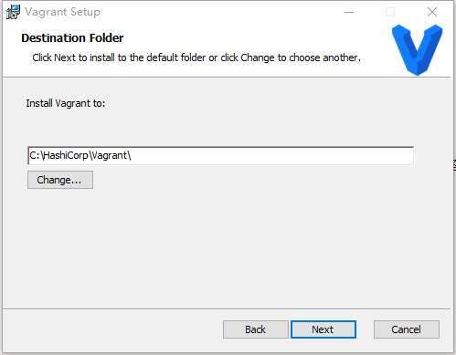
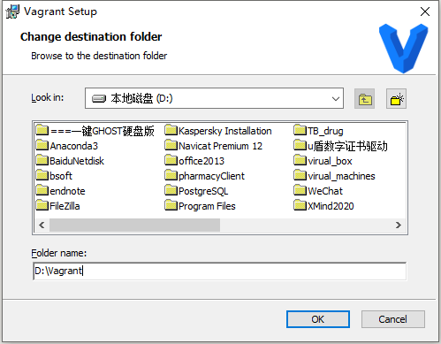
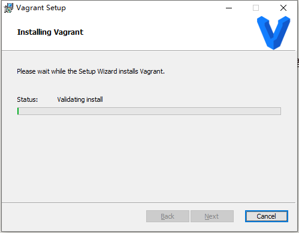
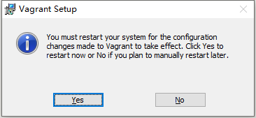

# Vagrant

# windows 系统安装Vagrant

## 安装

下载`Vagrant`安装包，点击[下载链接][1]开始下载

[1]: https://releases.hashicorp.com/vagrant/2.2.14/vagrant_2.2.14_x86_64.msi

双击下载的安装包，

同意安装协议

点击`Change...`选择安装路径，

这里选择D盘进行安装（因为D盘磁盘剩余空间较多），自定义安装路径为`D:\Vagrant`

点击`下一步`开始安装

整个安装过程耗时10分钟，

安装完成需要重启计算机以使软件配置生效，

