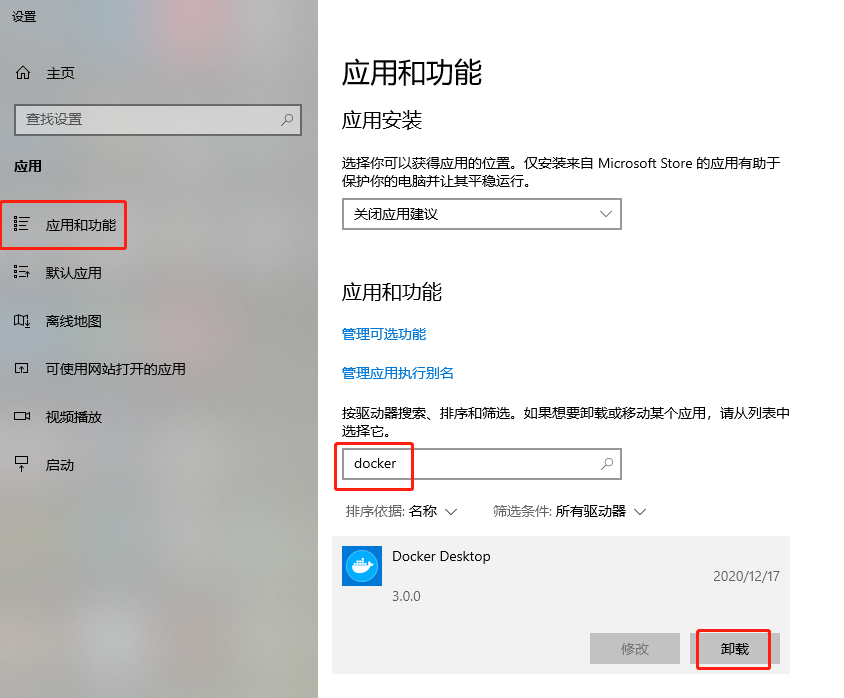

# docker

# windows 系统安装docker

用于Windows的Docker桌面是为在Windows 10上运行而设计的Docker。它是一个本机Windows应用程序，为构建，运输和运行dockerized应用程序提供了易于使用的开发环境。 适用于Windows的Docker桌面使用Windows原生的Hyper-V虚拟化和网络连接，是在Windows上开发Docker应用程序的最快，最可靠的方法。 Windows的Docker桌面支持同时运行Linux和Windows Docker容器。

## 安装

下载`Docker for Windows Installer`安装包，点击[下载链接][1]开始下载

[1]: https://desktop.docker.com/win/stable/Docker%20Desktop%20Installer.exe

## 安装

关闭杀毒软件，

如，电脑管家

双击Docker for Windows Installer开始安装程序，如下

等待下载，

提示开启windows的虚拟机功能，并且把软件快捷方式添加到桌面。

等待解压并安装完成，

安装完成，

点击`Close and restart`按钮，Docker会自动重启系统（注意保存好当前工作内容）。通知区域中的鲸鱼表示Docker正在运行，并可从终端访问。

如出现报错，可参照

卸载docker，重新安装，

1. 右键单击Windows 按钮并选择“应用和功能”。 ...
2. 选择相关设置下右侧的“程序和功能”。 ...
3. 输入“docker”查询软件。 ...
4. 点击查询结果，选择`卸载`。

**通过“设置”启用\**Hyper\**-\**V\** 角色**

1. 右键单击Windows 按钮并选择“应用和功能”。 ...
2. 选择相关设置下右侧的“程序和功能”。 ...
3. 选择“打开或关闭Windows 功能”。 ...
4. 选择“**Hyper**-**V**”，然后单击“确定”。

确保你的电脑操作系统是 Windows 10 专业版本（Pro） 或者企业版（ Enterprise）

可以通过桌面——我的电脑——属性查看，如下图所示

如本例电脑为`Windows 10 企业版`

## 运行

打开一个命令行终端，如PowerShell，并尝试一些Docker命令!运行docker版本检查版本。运行hello-world来验证docker可以拉出并运行图像。