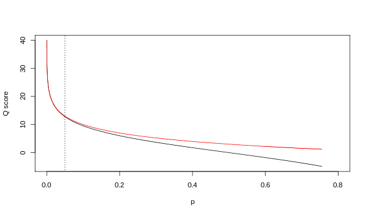

# [FASTQ格式](https://www.cnblogs.com/yahengwang/p/8973948.html)

​    FASQT格式是用于存储生物序列（通常是核苷酸序列）及其相应的碱基质量分数的一种文本格式。为简洁起见，序列字母和质量分数均使用单个ASCII字符进行编码。最初由[Wellcome Trust Sanger Institute](https://zh.wikipedia.org/wiki/Wellcome_Trust_Sanger_Institute)（桑格研究所）开发用于捆绑FASTA格式的序列和其碱基质量分数的，现在已成为存储Illumina Genome Analyzer（Illumina基因组分析仪）等高通量测序仪的标准输出格式。

# FASTQ文件格式

- 第1行，以“@” 字符开头，后面跟着一个序列标识符和一个可选的描述（像FASTA格式标题行）。
- 第2行，原始序列字符。
- 第3行，以“+”字符开头，后面可选地跟着相同的序列标识符或者任何描述。
- 第4行，第2行序列每个碱基的质量编码值，包含与第2行字符数量相同的符号。

​    包含单个序列的FASTQ文件示例如下：

> ```
> @SEQ_ID
> GATTTGGGGTTCAAAGCAGTATCGATCAAATAGTAAATCCATTTGTTCAACTCACAGTTT
> +
> !''*((((***+))%%%++)(%%%%).1***-+*''))**55CCF>>>>>>CCCCCCC65
> ```

​    字符“！”和“~”分别代表最低和最高质量，下面是ASCII代表质量值从左到右顺序递增：

> ```
> !"#$%&'()*+,-./0123456789:;<=>?@ABCDEFGHIJKLMNOPQRSTUVWXYZ[\]^_`abcdefghijklmnopqrstuvwxyz{|}~
> ```

# Illumina序列标识符

​    来自Illumina软件的序列使用系统标识符：

> ```
> @HWUSI-EAS100R:6:73:941:1973#0/1
> ```

| HWUSI-EAS100R | the unique instrument name                                   |
| ------------- | ------------------------------------------------------------ |
| 6             | flowcell lane                                                |
| 73            | tile number within the flowcell lane                         |
| 941           | 'x'-coordinate of the cluster within the tile                |
| 1973          | 'y'-coordinate of the cluster within the tile                |
| #0            | index number for a multiplexed sample (0 for no indexing)    |
| /1            | the member of a pair, /1 or /2 *(paired-end or mate-pair reads only)* |

​    Illumina流程1.4版本以后，使用#NNNNNN代替#0作为多重ID，NNNNNN是多重标签的序列。

> ```
> @EAS139:136:FC706VJ:2:2104:15343:197393 1:Y:18:ATCACG
> ```

| EAS139  | the unique instrument name                                   |
| ------- | ------------------------------------------------------------ |
| 136     | the run id                                                   |
| FC706VJ | the flowcell id                                              |
| 2       | flowcell lane                                                |
| 2104    | tile number within the flowcell lane                         |
| 15343   | 'x'-coordinate of the cluster within the tile                |
| 197393  | 'y'-coordinate of the cluster within the tile                |
| 1       | the member of a pair, 1 or 2 *(paired-end or mate-pair reads only)* |
| Y       | Y if the read is filtered, N otherwise                       |
| 18      | 0 when none of the control bits are on, otherwise it is an even number |
| ATCACG  | index sequence                                               |

​    请注意，最新版本的Illumina软件会输出样本编号（从样本表中读取替代）代替索引序列。例如，以下情况可能出现在批次的第一个样本中：

> ```
> @EAS139:136:FC706VJ:2:2104:15343:197393 1:N:18:1
> ```

# NCBI SRA数据

​    来自NCBI/EBI SRA数据库的FASTQ文件通常包含如下一个描述：

> ```
> @SRR001666.1 071112_SLXA-EAS1_s_7:5:1:817:345 length=36
> GGGTGATGGCCGCTGCCGATGGCGTCAAATCCCACC
> +SRR001666.1 071112_SLXA-EAS1_s_7:5:1:817:345 length=36
> IIIIIIIIIIIIIIIIIIIIIIIIIIIIII9IG9IC
> ```

在本例中，由一个NCBI分配的标识符、描述保存Solexa/Illumina的原始标识符和read长度。测序是在双端模式下进行的（~500bp插入大小），详见SRR001666。值得注意的是，当使用带缺省参数设置的fastq-dump从SRA数据中提取数据时，fastq-dump将正向read和反向read的序列连接在一起，提取的序列具有双倍长度，丢失了双端测序信息。

> ```
> $ /opt/sratoolkit.2.5.7-centos_linux64/bin/fastq-dump SRR001666
> @SRR001666.1 071112_SLXA-EAS1_s_7:5:1:817:345 length=72
> GGGTGATGGCCGCTGCCGATGGCGTCAAATCCCACCAAGTTACCCTTAACAACTTAAGGGTTTTCAAATAGA
> +SRR001666.1 071112_SLXA-EAS1_s_7:5:1:817:345 length=72
> IIIIIIIIIIIIIIIIIIIIIIIIIIIIII9IG9ICIIIIIIIIIIIIIIIIIIIIDIIIIIII>IIIIII/
> @SRR001666.2 071112_SLXA-EAS1_s_7:5:1:801:338 length=72
> GTTCAGGGATACGACGTTTGTATTTTAAGAATCTGAAGCAGAAGTCGATGATAATACGCGTCGTTTTATCAT
> +SRR001666.2 071112_SLXA-EAS1_s_7:5:1:801:338 length=72
> IIIIIIIIIIIIIIIIIIIIIIIIIIIIIIII6IBIIIIIIIIIIIIIIIIIIIIIIIGII>IIIII-I)8I
> ```

更好的方法是保存原始材料并分成两个或三个文件（正向、反向、单个），例如：

> ```
> $ /opt/sratoolkit.2.5.7-centos_linux64/bin/fastq-dump --origfmt --split-3 SRR001666
> $ head SRR001666_1.fastq  SRR001666_2.fastq
> ==> SRR001666_1.fastq <==
> @071112_SLXA-EAS1_s_7:5:1:817:345
> GGGTGATGGCCGCTGCCGATGGCGTCAAATCCCACC
> +071112_SLXA-EAS1_s_7:5:1:817:345
> IIIIIIIIIIIIIIIIIIIIIIIIIIIIII9IG9IC
> @071112_SLXA-EAS1_s_7:5:1:801:338
> GTTCAGGGATACGACGTTTGTATTTTAAGAATCTGA
> +071112_SLXA-EAS1_s_7:5:1:801:338
> IIIIIIIIIIIIIIIIIIIIIIIIIIIIIIII6IBI
> 
> ==> SRR001666_2.fastq <==
> @071112_SLXA-EAS1_s_7:5:1:817:345
> AAGTTACCCTTAACAACTTAAGGGTTTTCAAATAGA
> +071112_SLXA-EAS1_s_7:5:1:817:345
> IIIIIIIIIIIIIIIIIIIIDIIIIIII>IIIIII/
> @071112_SLXA-EAS1_s_7:5:1:801:338
> AGCAGAAGTCGATGATAATACGCGTCGTTTTATCAT
> +071112_SLXA-EAS1_s_7:5:1:801:338
> IIIIIIIIIIIIIIIIIIIIIIGII>IIIII-I)8I
> ```

另请注意，NCBI已将此FASTQ数据从原始Solexa/Illumina编码转换为Sanger标准（请参阅下面的编码）。

# 变动

## 质量

​    质量值Q是p的整数映射（即相应碱基判定不正确的概率），主要有两种不同的公式被使用。第一种是评估碱基判定的可靠性的不标准Sanger变体，也称为Phred质量分数：

Qphred = -10log10p

​    Solexa流程（即与Illumina Genome Analyzer一起交付的软件）较早使用了不同的映射编码概率p/（1-p），而不是p：

Qillumina-prior to v.1.4 = -10log10(p/(1-p))

​    虽然两个映射在更高质量值处渐近地相同，但它们在较低质量水平下不同（即，近似p> 0.05等同Q <13）。



使用Sanger（红色）和Solexa（黑色）方程（如上所述）的Q和p之间的关系。 垂直虚线表示p = 0.05，或等同地Q≈13。

​    llumina流程1.4版用户指南（附录B，第122页）指出：“评分定义为：Q=10*log10(p/(1-p))，其中p是对应碱基判定的概率”。Illumina流程1.5版用户指南（第5页新增内容）对此进行了修改，“流程1.3版质量评分方案已更改为Phred评分方案，质量得分按Phred+64被转换为ASCII字符表示。”

## 编码

- Sanger格式可以使用ASCII 33~126字符表示0~93的Phred质量分数（尽管在原始read数据中，Phred质量分数很少超过60，但在组装或比对中可能有更高的分数）。这种方法也用于SAM格式中。根据seqanswers.com 上的公告，到2011年2月底，Illumina最新版本（1.8）的CASAVA流程将直接产生Sanger格式的fastq文件。
- Solexa/Illumina 1.0格式可以使用ASCII 59~126字符表示-5~62的Solexa/Illumina评分（原始read数据Solexa评分仅为-5~40）。
- 从Illumina 1.3版本开始，到Illumina 1.8版本，使用ASCII 64~126表示0~62的Phred质量分数（原始数据中Phred分数仅为0~40）。
- 从Illumina1.5版本开始，到Ilumina 1.8版本，Phred分数为0~2的含义略有不同。值0和1不在使用，值2（ASCII字符“B”）作为read片段结束的质量控制指示器。Illumina手册（第30页）内容：如果read以质量最差的一段（Q15或更低）结束，则片段中的所有质量值将被值2替换（ASCII字符“B”）…此Q2指标不能表示特定的错误率，而是表示read的特定最终部分不应用于进一步分析。此外，在Illumina 1.6版本之前，质量分数编码为“B”的碱基也可能在read内部发生，如下所示：

> ```
> @HWI-EAS209_0006_FC706VJ:5:58:5894:21141#ATCACG/1
> TTAATTGGTAAATAAATCTCCTAATAGCTTAGATNTTACCTTNNNNNNNNNNTAGTTTCTTGAGATTTGTTGGGGGAGACATTTTTGTGATTGCCTTGAT
> +HWI-EAS209_0006_FC706VJ:5:58:5894:21141#ATCACG/1
> efcfffffcfeefffcffffffddf`feed]`]_Ba_^__[YBBBBBBBBBBRTT\]][]dddd`ddd^dddadd^BBBBBBBBBBBBBBBBBBBBBBBB
> ```

- 对于原始的read，质量分数的范围取决于所使用的技术和碱基判定标准，但对于最新的Illumina流程，通常会达到41.由于最大观察质量分数以前仅为40，因此各种脚本工具在遇到质量值大于40的数据时会中断。而对于经过过处理的read，质量分数可能会更高。例如：Illumina的Long Read Sequencing Service（以前的Moleculo）中read的质量分数为45。

> ```
>   SSSSSSSSSSSSSSSSSSSSSSSSSSSSSSSSSSSSSSSSS.....................................................
>   ..........................XXXXXXXXXXXXXXXXXXXXXXXXXXXXXXXXXXXXXXXXXXXXXX......................
>   ...............................IIIIIIIIIIIIIIIIIIIIIIIIIIIIIIIIIIIIIIIII......................
>   .................................JJJJJJJJJJJJJJJJJJJJJJJJJJJJJJJJJJJJJJJJ.....................
>   LLLLLLLLLLLLLLLLLLLLLLLLLLLLLLLLLLLLLLLLLL....................................................
>   !"#$%&'()*+,-./0123456789:;<=>?@ABCDEFGHIJKLMNOPQRSTUVWXYZ[\]^_`abcdefghijklmnopqrstuvwxyz{|}~
>   |                         |    |        |                              |                     |
>  33                        59   64       73                            104                   126
>   0........................26...31.......40                                
>                            -5....0........9.............................40 
>                                  0........9.............................40 
>                                     3.....9..............................41 
>   0.2......................26...31........41                              
> 
>  S - Sanger        Phred+33,  raw reads typically (0, 40)
>  X - Solexa        Solexa+64, raw reads typically (-5, 40)
>  I - Illumina 1.3+ Phred+64,  raw reads typically (0, 40)
>  J - Illumina 1.5+ Phred+64,  raw reads typically (3, 41)
>      with 0=unused, 1=unused, 2=Read Segment Quality Control Indicator (bold) 
>      (Note: See discussion above).
>  L - Illumina 1.8+ Phred+33,  raw reads typically (0, 41)
> ```

## 色域

​    SOLiD数据，除了第一个位置，序列信息存储在色域中。质量值是Sanger格式的质量值，比对工具在质量值的首选版本上有所不同：其中一些包括主要和核苷酸的质量评分，而另一些则没有。序列read存档文件包含此质量分数。

## 模拟

​    FASTQ read模拟主要有以下几个工具：[ART](https://www.ncbi.nlm.nih.gov/pmc/articles/PMC3278762)、[XS](https://www.ncbi.nlm.nih.gov/pmc/articles/PMC3927261)。

## 压缩

​    质量分数占FASTQ格式所需磁盘空间（压缩前）的一般左右，因此压缩质量值可显著降低存储需求并加快测序数据的分析和传输。文献中提到的压缩方式主要无损和有损压缩。例如，有损压缩[QualComp](https://www.ncbi.nlm.nih.gov/pmc/articles/PMC3698011)，无损压缩[SCALCE](https://www.ncbi.nlm.nih.gov/pmc/articles/PMC3509486/)、[fastqz](http://mattmahoney.net/dc/fastqz/)。

​    从Hiseq 2500开始，Illumina提供了将粗粒度质量输出到质量表的选项。分积分数直接从经验质量分数表中计算得出，该分数表与测序实验中所使用的硬件、软件和化学物质有关。

# 文件拓展名

​    FASTQ文件并没有标准的文件拓展名，但通常都是.fq或.fastq。

## 格式转换器

- [Biopython](https://en.wikipedia.org/wiki/BioPython) version 1.51 onwards (interconverts Sanger, Solexa and Illumina 1.3+)
- [EMBOSS](https://en.wikipedia.org/wiki/EMBOSS) version 6.1.0 patch 1 onwards (interconverts Sanger, Solexa and Illumina 1.3+)
- [BioPerl](https://en.wikipedia.org/wiki/BioPerl) version 1.6.1 onwards (interconverts Sanger, Solexa and Illumina 1.3+)
- [BioRuby](https://en.wikipedia.org/wiki/BioRuby) version 1.4.0 onwards (interconverts Sanger, Solexa and Illumina 1.3+)
- [BioJava](https://en.wikipedia.org/wiki/BioJava) version 1.7.1 onwards (interconverts Sanger, Solexa and Illumina 1.3+)
- [MAQ](http://maq.sourceforge.net/) can convert from Solexa to Sanger (use this [patch](http://sourceforge.net/tracker/index.php?func=detail&aid=2824334&group_id=191815&atid=938893) to support Illumina 1.3+ files).
- [fastx_toolkit](http://hannonlab.cshl.edu/fastx_toolkit/) The included fastq_quality_converter program can convert Illumina to Sanger

## 命令行转换

**FASTQ to FASTA format:**

> ```
> zcat input_file.fastq.gz | awk 'NR%4==1{printf ">%s\n", substr($0,2)}NR%4==2{print}' > output_file.fa
> ```

**Illumina FASTQ 1.8 to 1.3**

 

> ```
> sed -e '4~4y/!"#$%&'\''()*+,-.\/0123456789:;<=>?@ABCDEFGHIJ/@ABCDEFGHIJKLMNOPQRSTUVWXYZ[\\]^_`abcdefghi/' myfile.fastq   # add -i to save the result to the same input file
> ```

**Illumina FASTQ 1.3 to 1.8**

 

> ```
> sed -e '4~4y/@ABCDEFGHIJKLMNOPQRSTUVWXYZ[\\]^_`abcdefghi/!"#$%&'\''()*+,-.\/0123456789:;<=>?@ABCDEFGHIJ/' myfile.fastq   # add -i to save the result to the same input file
> ```

**Illumina FASTQ 1.8 raw quality to binned quality (HiSeq Qtable 2.10.1, HiSeq 4000 )**

 

> ```
> sed -e '4~4y/!"#$%&'\''()*+,-.\/0123456789:;<=>?@ABCDEFGHIJKL/))))))))))----------77777<<<<<AAAAAFFFFFJJJJ/' myfile.fastq   # add -i to save the result to the same input file
> ```

**Illumina FASTQ 1.8 raw quality to clinto format (a visual block representation)**

 

> ```
> sed -e 'n;n;n;y/!"#$%&'\''()*+,-.\/0123456789:;<=>?@ABCDEFGHIJKL/▁▁▁▁▁▁▁▁▂▂▂▂▂▃▃▃▃▃▄▄▄▄▄▅▅▅▅▅▆▆▆▆▆▇▇▇▇▇██████/' myfile.fastq   # add -i to save the result to the same input file
> ```

#  

# 参考资料

[wiki FASTQ](https://en.wikipedia.org/wiki/FASTQ_format#File_extension)

 

转载请标明《http://www.cnblogs.com/yahengwang/p/8973948.html》

