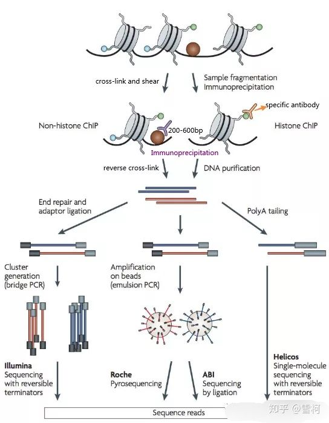

# 什么是染色质免疫共沉淀测序（ChIP-seq）？

结合CHIP和NGS技术，把细胞内的DNA与蛋白质交联（即将目标蛋白与染色质连结起来）后裂解细胞，分离染色体，通过超声或酶处理将染色质随机切割，利用抗原抗体的特异性识别反应，将与目的蛋白相结合的DNA片段沉淀下来，再通过反交联释放结合蛋白的DNA片段，最后测序获得DNA片段的序列。

缺点：常规ChIP-Seq实验需要大量细胞，且实验重复性差、信噪比低。
优点：ChIP-Seq由于能真实、完整地反映结合在DNA序列上的靶蛋白，是目前全基因组水平研究DPI的标准实验技术。
应用：ChIP被用来研究细胞内蛋白质与DNA相互作用（这点在乳糖操纵子机制中相信大家已经有所了解），具体来说就是明确特定的蛋白（如转录因子）是否结合特定基因组区域（如启动子或其它DNA结合位点）；ChIP还被用来确定基因组上与组蛋白修饰相关的特定位点（即组蛋白修饰酶类的靶标）。

