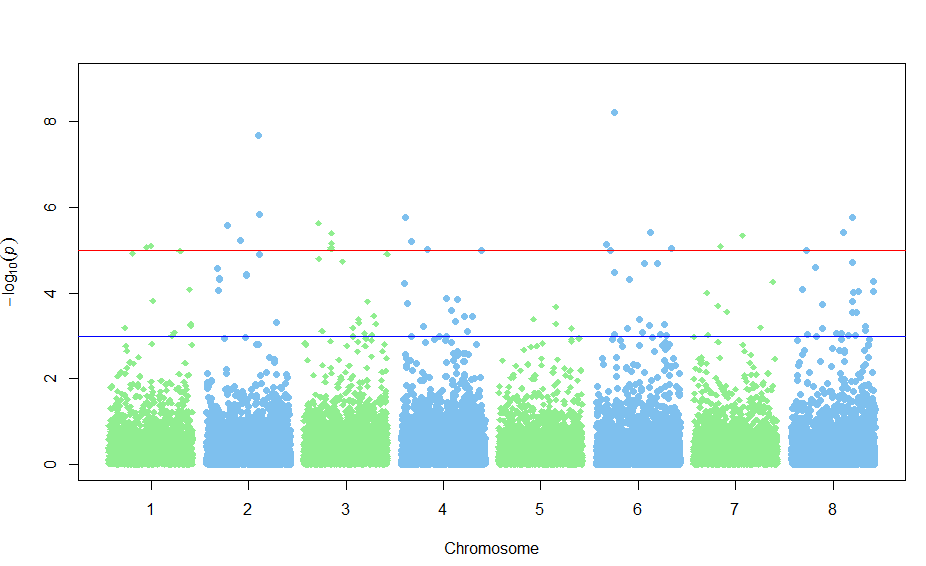

# 曼哈顿图

在生物和统计学上，做频率统计、突变分布、GWAS关联分析的时候，我们经常会看到一些非常漂亮的manhattan plot，能够对候选位点的分布和数值一目了然。位点坐标和pvalue。map文件至少包含三列——染色体号，SNP名字，SNP物理位置。assoc文件包含SNP名字和pvalue。haploview即可画出。

这是一个朋友说需要相关图形，因此我就做了一个。

结果图：

