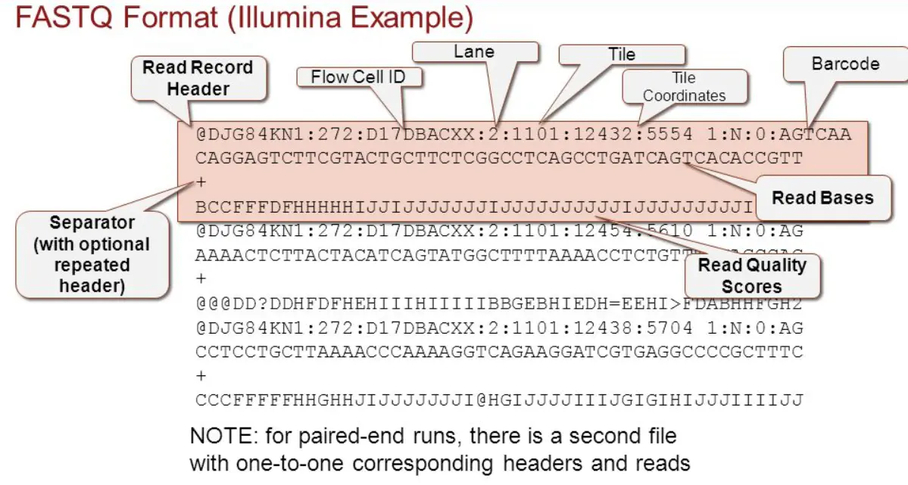
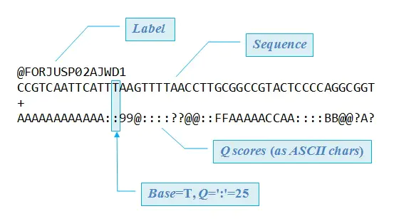
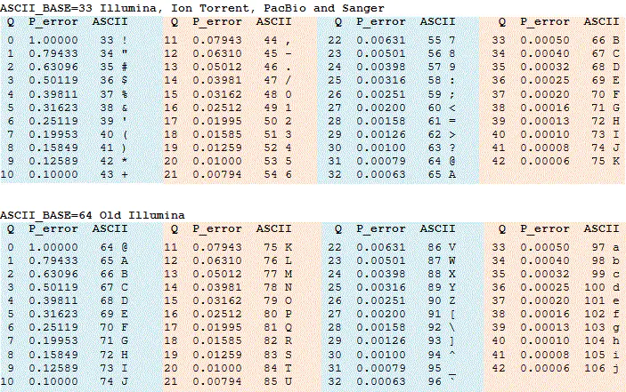
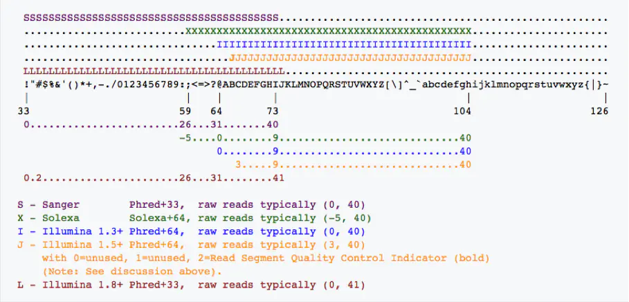

# FASTQ


## 功能简介

 FASQT格式是用于存储生物序列（通常是核苷酸序列）及其相应的碱基质量分数的一种文本格式。为简洁起见，序列字母和质量分数均使用单个ASCII字符进行编码。最初由[Wellcome Trust Sanger Institute](https://zh.wikipedia.org/wiki/Wellcome_Trust_Sanger_Institute)（桑格研究所）开发用于捆绑FASTA格式的序列和其碱基质量分数的，现在已成为存储Illumina Genome Analyzer（Illumina基因组分析仪）等高通量测序仪的标准输出格式。 通俗讲FASTQ格式就是工程师开发的一种用于存储ATCG序列的文件。

## 文件格式

 FASTQ格式（文件格式一般以.fq结尾）序列一般都包含有四行，第一行由@开始，后面跟着序列的描述信息。第二行是序列。第三行由'+'开始，后面也可以跟着序列的描述信息。第四行是第二行序列的质量评价，字符数跟第二行的序列是相等的。 

一个例子，

```
@HWUSI-EAS100R:6:73:941:1973#0/1
GATTTGGGGTTCAAAGCAGTATCGATCAAATAGTAAATCCATTTGTTCAACTCACAGTT
+HWUSI-EAS100R:6:73:941:1973#0/1
!''*((((***+))%%%++)(%%%%).1***-+*''))**55CCF>>>>>>CCCCCCC6
```

各行具体含义如下，

- 第1行， 后面是reads的ID以及其他信息，例如上例中 HWUSI-EAS100R代表Illumina设备名称，6代表flowcell中的第六个lane，73代表第六个lane中的第73个tile，941:1973代表该read在该tile中的x：y坐标信息；#0，若为多样本的混合作为输入样本，则该标志代表样本的编号，用来区分个样本中的reads；/1代表paired end中的前一个read。 
- 第2行，原始序列字符。
- 第3行，以“+”字符开头， 跟随着该read的名称（一般与@后面的内容相同），但有时可以省略，但“+”一定不能省。 
- 第4行，第2行序列每个碱基的质量编码值，包含与第2行字符数量相同的符号。


完整的格式解读说明如下：

  

​																			

  

​																				

### 序列标识符

 Illumina数据： 

```
@EAS139:136:FC706VJ:2:2104:15343:197393 1:Y:18:ATCACG
```

具体规范为，

| EAS139  | the unique instrument name                                   |
| ------- | ------------------------------------------------------------ |
| 136     | the run id                                                   |
| FC706VJ | the flowcell id                                              |
| 2       | flowcell lane                                                |
| 2104    | tile number within the flowcell lane                         |
| 15343   | 'x'-coordinate of the cluster within the tile                |
| 197393  | 'y'-coordinate of the cluster within the tile                |
| 1       | the member of a pair, 1 or 2 *(paired-end or mate-pair reads only)* |
| Y       | Y if the read is filtered, N otherwise                       |
| 18      | 0 when none of the control bits are on, otherwise it is an even number |
| ATCACG  | index sequence                                               |


NCBI SRA数据：

 来自NCBI/EBI SRA数据库的FASTQ文件通常包含如下一个描述： 

```
@SRR001666.1 071112_SLXA-EAS1_s_7:5:1:817:345 length=36
```

 在本例中，由一个NCBI分配的标识符、描述保存Solexa/Illumina的原始标识符和read长度。 


### 质量值 

 Illumina测序仪是按照荧光信号来判断所测序的碱基是哪一种的，例如红黄蓝绿分别对应ATCG，那么一旦出现一个紫色的信号该怎么判断呢，因此对每个结果都有一个概率用于衡量测序错误率。

目前用Phred quality score来衡量该read中每个碱基的质量，既`Phred=-10lgP `，其中P代表该碱基被测序错误的概率，如果该碱基测序出错的概率为0.001，则Q应该为30， 错误率越低，其Q值越高，该碱基测序结果越可靠。 

### 质量值编码

Phred Q在fastq文件中实际以对应的 ASCII码 表示， ASCII码的0-31位都是控制字符，没法打印和保存，能打印的从要从32位的`Space`开始， 因此通过`Phred  +  固定值 `对 Phred Q进行编码， 依据固定值的不同，有  phred33 与 Phred64 两种编码方式

  


 Phred33的字符使用33-73，而Phred64使用59（包括）-104之间的ASCII码 。目前主流测序数据都采用Phred33格式编码。

以Phred33编码为例，Phred Q为30，则编码为30+33=63，63对应的ASCii码为`？`，则在第四行中该碱基对应的质量代表值即为`？`

 下面是不同版本质量得分和质量字符ASCII的关系 

  


# 原文链接

 [wiki FASTQ](https://en.wikipedia.org/wiki/FASTQ_format#File_extension) 